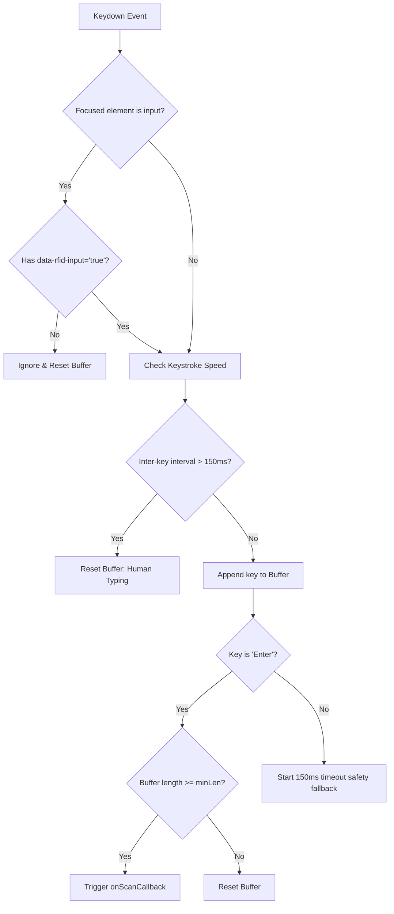
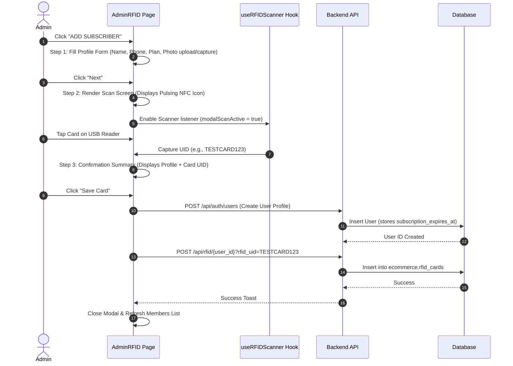
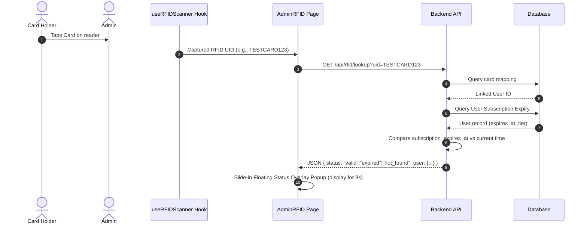

# RFID Integration & System Architecture

This document explains the technical architecture and flows for **adding users with RFID** and **reading/looking up RFID cards** within the Aura Prints & Gifts ecosystem.

---

## 1. Hardware Layer: USB HID Emulation

The RFID reader operates as a **USB HID (Human Interface Device) Keyboard Emulator**. 
- It does **not** require custom drivers, virtual serial ports, or WebUSB APIs.
- When an RFID card is tapped, the hardware acts as a fast keyboard, typing the card's **UID string** (e.g., `A1B2C3D4`) character-by-character at speeds exceeding 1,000 characters per second, followed by an **Enter** (`\n`) key.

---

## 2. Frontend Input Capture: `useRFIDScanner` Hook

To distinguish between manual keyboard entry by humans and fast scanner inputs, the system uses a custom hook: `useRFIDScanner`.

### Detection Logic


- **Speed Filtering**: Captures keystrokes with an inter-key delay of `< 50ms`. A human typing at 80 WPM averages a `~150ms` gap, making it easy to filter out manual input.
- **Focus Shielding**: Keydown events are ignored if the user is typing into any normal text fields (e.g. search bars, textareas) unless the input has a `data-rfid-input="true"` tag.

---

## 3. Flow: Adding a Subscriber with RFID

Adding a subscriber and registering their card is a structured 3-step wizard in the frontend UI.



### Steps:
1. **Details Form**: The administrator fills out basic information, takes a live camera photo or uploads an image, and selects a membership tier (Student, Silver, Gold, Premium).
2. **Scan Step**: A dedicated scanner listener is enabled. When the card is tapped, the hook captures the typed text, normalization is applied (trimmed and capitalized), and the wizard automatically moves to step 3.
3. **Save**: The backend creates the user profile, calculates `subscription_expires_at` based on the chosen tier, and maps the RFID UID to the created user's ID in the database.

---

## 4. Flow: Reading / Looking up a User via RFID Tap

When an administrator is viewing the `AdminRFID` page, a global card-swipe listener is active in the background.



### Backend Resolution States:
The backend computes subscription status relative to the server time:
- **`valid`**: `subscription_expires_at > UTC NOW()`. Displays a **Green** card popup with user photo, name, plan tier, and expiration date.
- **`expired`**: `subscription_expires_at <= UTC NOW()`. Displays a **Red** warning popup with details, allowing the Admin to click "Renew".
- **`no_plan`**: Expiry date is null. Displays a **Yellow** info popup.
- **`not_found`**: UID is not registered in the `rfid_cards` table. Displays a **Grey** alert with a "Register Card" action button to bind it.

---

## 5. Database Schema Relations

```sql
-- Represents the linked user account and subscription status
TABLE ecommerce.users (
    id UUID PRIMARY KEY,
    name VARCHAR(255) NOT NULL,
    email VARCHAR(255) UNIQUE,
    subscription_tier SMALLINT NOT NULL DEFAULT 0,
    subscription_expires_at TIMESTAMP WITH TIME ZONE -- Tracks plan validity
);

-- Binds a unique card to a user profile
TABLE ecommerce.rfid_cards (
    id UUID PRIMARY KEY,
    user_id UUID UNIQUE NOT NULL REFERENCES ecommerce.users(id),
    rfid_uid VARCHAR(255) UNIQUE NOT NULL, -- Normalized uppercase UID
    assigned_at TIMESTAMP WITH TIME ZONE DEFAULT CURRENT_TIMESTAMP,
    assigned_by UUID REFERENCES ecommerce.users(id)
);
```
